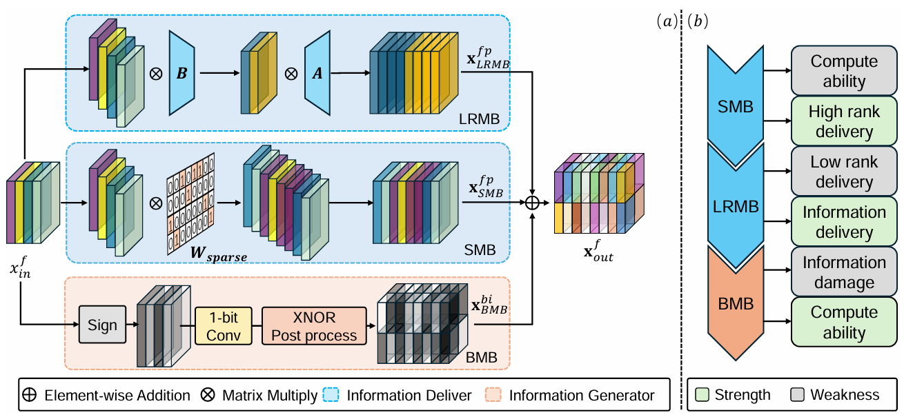
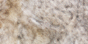
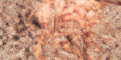
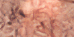
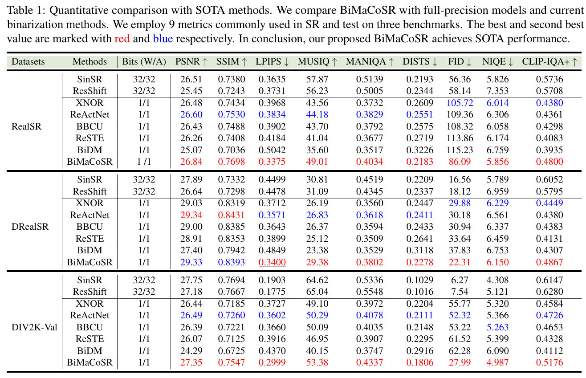
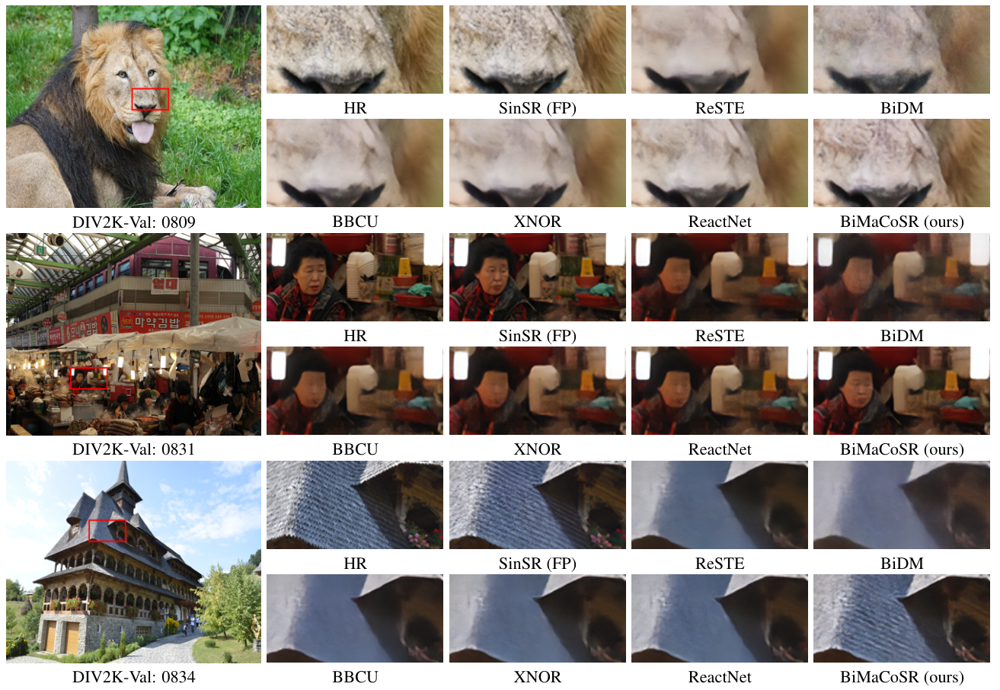
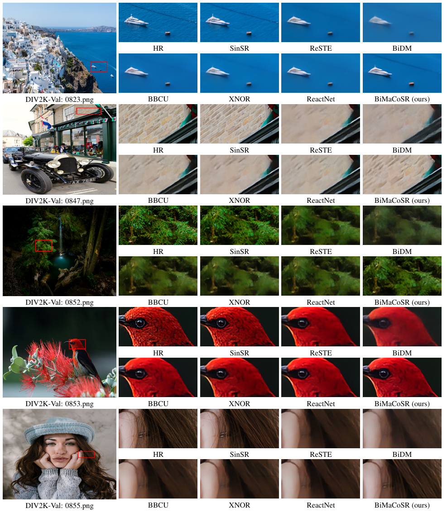
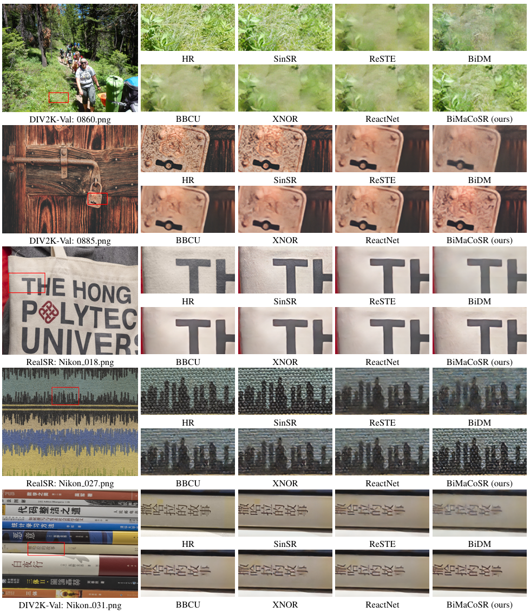

# BiMaCoSR: Binary One-Step Diffusion Model Leveraging Flexible Matrix Compression for Real Super-Resolution

[Kai Liu](https://kai-liu001.github.io/), [Kaicheng Yang](https://racoonykc.github.io/), [Zheng Chen](https://zhengchen1999.github.io/), [Zhiteng Li](https://zhitengli.github.io/),[Yong Guo](https://www.guoyongcs.com/), [Wenbo Li](https://fenglinglwb.github.io/), [Linghe Kong](https://www.cs.sjtu.edu.cn/~linghe.kong/), and [Yulun Zhang](http://yulunzhang.com/).

"BiMaCoSR: Binary One-Step Diffusion Model Leveraging Flexible Matrix Compression for Real Super-Resolution", arXiv, 2025

[[arXiv](https://arxiv.org/abs/2502.00333)] [[supplementary material](https://github.com/Kai-Liu001/BiMaCoSR/releases/download/Supp/supplemental-material.pdf)] [visual results] [pretrained models]

#### 🔥🔥🔥 News

- **2025-02-04:** This arXiv version and supplementary material are released.
- **2025-02-01:** This repo is released.

---

> **Abstract:** *While super-resolution (SR) methods based on diffusion models (DM) have demonstrated inspiring performance, their deployment is impeded due to the heavy request of memory and computation. Recent researchers apply two kinds of methods to compress or fasten the DM. One is to compress the DM into 1-bit, aka binarization, alleviating the storage and computation pressure. The other distills the multi-step DM into only one step, significantly speeding up inference process. Nonetheless, it remains impossible to deploy DM to resource-limited edge devices. To address this problem, we propose BiMaCoSR, which combines binarization and one-step distillation to obtain extreme compression and acceleration. To prevent the catastrophic collapse of the model caused by binarization, we proposed sparse matrix branch (SMB) and low rank matrixbranch (LRM). Both auxiliary branches pass the full-precision (FP) information but in different ways. SMB absorbs the extreme values and its output is high rank, carrying abundant FP information. Whereas, the design of LRMB is inspired by LoRA and is initialized with the top r SVD components, outputting low rank representation. The computation and storage overhead of our proposed branches can be safely ignored. Comprehensive comparison experiments are conducted to exhibit BiMaCoSR outperforms current state-of-the-art binarization methods and gains competitive performance compared with FP one-step model. BiMaCoSR achieves a 23.8x compression ratio and a 27.4x speedup ratio compared to FP counterpart.* 

---

---

| Image | HR | [SinSR(FP)](https://github.com/wyf0912/SinSR) | [XNOR](https://arxiv.org/abs/1603.05279) |  [ReSTE](https://github.com/DravenALG/ReSTE)  | BiMaCoSR (ours) |
| :--: | :--: | :--: | :--: | :--: | :--: |
|  |  |  |  |  |  |
|  |  |  |  |  |  |

---

## 🔖 TODO

- [ ] Release datasets.
- [ ] Release training and testing code.
- [ ] Release pre-trained BiMaCoSR.
- [ ] Provide WebUI.
- [ ] Provide HuggingFace🤗 demo.

## 🔗Contents

1. [Results](#Results)
1. [Acknowledgements](#Acknowledgements)
<!-- 1. [Datasets](#Datasets)
1. [Models](#Models)
2. [Training](#Training)
3. [Testing](#Testing) -->

<!-- 6. [Citation](#Citation) -->

---

<!-- ## 📦Datasets

The datasets will be provided soon.

## Models

The pre-trained model will be provided soon.

## Training

The training code will be provided soon.

## Testing

The testing code will be provided soon. -->

## 🔎Results

We achieve state-of-the-art performance. Detailed results can be found in the paper. All visual results of BiMaCoSR will be provided soon.

Click to expand

- results in Table 1 of the main paper

  

- visual comparison (x4) in the main paper

  

- visual comparison (x4) in the supplementary material

  
  

## 💡Acknowledgements

This code is built on [SinSR](https://github.com/wyf0912/SinSR).