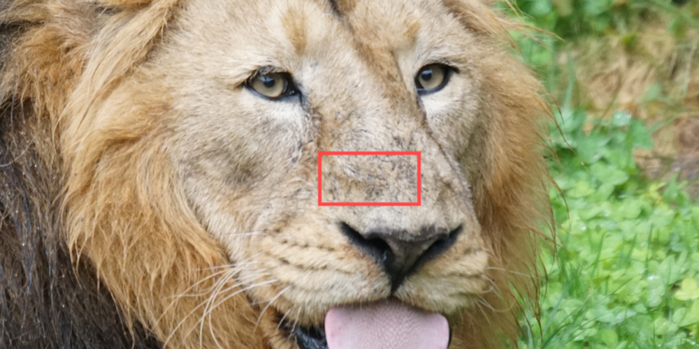
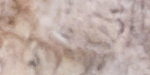
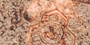

# BiMaCoSR: Binary One-Step Diffusion Model Leveraging Flexible Matrix Compression for Real Super-Resolution

[Kai Liu](https://kai-liu001.github.io/), [Kaicheng Yang](https://racoonykc.github.io/), [Zheng Chen](https://zhengchen1999.github.io/), [Zhiteng Li](https://zhitengli.github.io/),[Yong Guo](https://www.guoyongcs.com/), [Wenbo Li](https://fenglinglwb.github.io/), [Linghe Kong](https://www.cs.sjtu.edu.cn/~linghe.kong/), and [Yulun Zhang](http://yulunzhang.com/).

"BiMaCoSR: Binary One-Step Diffusion Model Leveraging Flexible Matrix Compression for Real Super-Resolution", arXiv, 2025

[[arXiv](https://arxiv.org/abs/2502.00333)] [[supplementary material](https://github.com/Kai-Liu001/BiMaCoSR/releases/download/Supp/supplemental-material.pdf)] [visual results] [[pretrained models](https://drive.google.com/file/d/1vh2hhHmvrz-LE0uqPXBk7mE8XZ_8W-NN/view?usp=drive_link)]

#### 🔥🔥🔥 News
- **2025-07-10:** Basic pipeline & checkpoint released.
- **2025-02-04:** This arXiv version and supplementary material are released.
- **2025-02-01:** This repo is released.

---

> **Abstract:** *While super-resolution (SR) methods based on diffusion models (DM) have demonstrated inspiring performance, their deployment is impeded due to the heavy request of memory and computation. Recent researchers apply two kinds of methods to compress or fasten the DM. One is to compress the DM into 1-bit, aka binarization, alleviating the storage and computation pressure. The other distills the multi-step DM into only one step, significantly speeding up inference process. Nonetheless, it remains impossible to deploy DM to resource-limited edge devices. To address this problem, we propose BiMaCoSR, which combines binarization and one-step distillation to obtain extreme compression and acceleration. To prevent the catastrophic collapse of the model caused by binarization, we proposed sparse matrix branch (SMB) and low rank matrixbranch (LRM). Both auxiliary branches pass the full-precision (FP) information but in different ways. SMB absorbs the extreme values and its output is high rank, carrying abundant FP information. Whereas, the design of LRMB is inspired by LoRA and is initialized with the top r SVD components, outputting low rank representation. The computation and storage overhead of our proposed branches can be safely ignored. Comprehensive comparison experiments are conducted to exhibit BiMaCoSR outperforms current state-of-the-art binarization methods and gains competitive performance compared with FP one-step model. BiMaCoSR achieves a 23.8x compression ratio and a 27.4x speedup ratio compared to FP counterpart.* 

---


---

| Image | HR | [SinSR(FP)](https://github.com/wyf0912/SinSR) | [XNOR](https://arxiv.org/abs/1603.05279) |  [ReSTE](https://github.com/DravenALG/ReSTE)  | BiMaCoSR (ours) |
| :--: | :--: | :--: | :--: | :--: | :--: |
|  |  |  |  |  |  |
|  |  |  |  |  |  |

---

## 🔖 TODO

- [x] Release datasets.
- [x] Release training and testing code.
- [x] Release pre-trained BiMaCoSR.
- [ ] Provide WebUI.
- [ ] Provide HuggingFace🤗 demo.

## 🔗Contents

1. [Environment](#Environment)
2. [Testing](#Testing)
3. [Training](#Training)
4. [Results](#Results)
5. [Acknowledgements](#Acknowledgements)

---

## 🌐 Environment

To set up the environment for this project, follow these steps:

1. **Clone the repository**:
    ```sh
    git clone https://github.com/Kai-Liu001/BiMaCoSR.git
    cd BiMaCoSR
    ```

2. **Create a conda environment**:
    ```sh
    conda create -n BiMaCoSR python=3.10
    conda activate BiMaCoSR
    pip install -r requirements.txt
    ```

By following these steps, you should be able to set up the environment and run the code successfully.

## Testing

To test the model, follow these steps:

1. **Download VQ-VAE and pretrained weights**:
   - Download [VQ-GAN weights](https://github.com/zsyOAOA/ResShift/releases/download/v2.0/autoencoder_vq_f4.pth), put it into BiMaCoSR/weights
   - Download [pretrained model weights](https://drive.google.com/file/d/1vh2hhHmvrz-LE0uqPXBk7mE8XZ_8W-NN/view?usp=drive_link) and [config](https://drive.google.com/file/d/1LZfQG4bNb0IGoCTtPgk1YwO7FciPhHpp/view?usp=drive_link), put this pair into BiMaCoSR/weights and BiMaCoSR/configs, we use them by abs path later.

2. **Run the testing script**:
   ```sh
    CUDA_VISIBLE_DEVICES=0 python inference_quant.py --config your_config_path --ckpt your_ckeckpoint_path --in_path LR_dir --out_path result_dir
## Training

To train the model, follow these steps:
1. **Download ResShift(teacher model weights) and SinSR(initial weights)**:
   - [Download Res-Shift weights](https://github.com/zsyOAOA/ResShift/releases/download/v2.0/resshift_realsrx4_s15_v1.pth), put it into ``BiMaCoSR/weights``
   - [Download SinSR weights](https://example.com/pretrained-weights),put it into ``BiMaCoSR/weights``
2. **Download Dataset**
   - [Download cropped imagenet for training](https://drive.google.com/file/d/1XxW5C7YcZByH3PAq-fk1XOTbfuSc2Ybn/view?usp=drive_link), put it into BiMaCoSR/data/train
   - Download any valid dataset you like, put it into ``BiMaCoSR/data/test``
   ```sh
    data/
    ├── train/train/
    │         ├── image1.png
    │         ├── image2.png
    │         └── ...
    ├── val/
    │   ├── LR/
    │   │   ├── image1.png
    │   │   ├── image2.png
    │   │   └── ...
    │   └── HR/
    │       ├── image1.png
    │       ├── image2.png
    │       └── ...
3. **Run the training script**:
   ```sh
   CUDA_VISIBLE_DEVICES=0 torchrun --standalone --nproc_per_node=1 --nnodes=1   main_distill.py --cfg_path your_config_path --save_dir logs/your_experiment_name

## 🔎Results

We achieve state-of-the-art performance. Detailed results can be found in the paper. All visual results of BiMaCoSR will be provided soon.

<details>
<summary>Click to expand</summary>

- results in Table 1 of the main paper

<p align="center">
  
</p>


- visual comparison (x4) in the main paper

<p align="center">
  
</p>


- visual comparison (x4) in the supplementary material

<p align="center">
  
  
</p>
</details>


# Evaluation

To evaluate the performance of BiMaCoSR, follow these steps:

1. **Run the evaluation script**:
   ```sh
   CUDA_VISIBLE_DEVICES=0 python metric.py --inp_imgs path/to/sr_dir  --gt_imgs path/to/gt_dir --log path/to/log_dir
   ```
4. **Pre-computed results**:
   For reference, we provide our [pre-computed results](https://drive.google.com/file/d/1lWOBRB_vbK69wXr_XPWsjxhjGeCUBsD-/view?usp=drive_link) .

The evaluation will generate detailed metrics comparing BiMaCoSR with other state-of-the-art methods as shown in our paper.

---

## 💡Acknowledgements

This code is built on [SinSR](https://github.com/wyf0912/SinSR).
